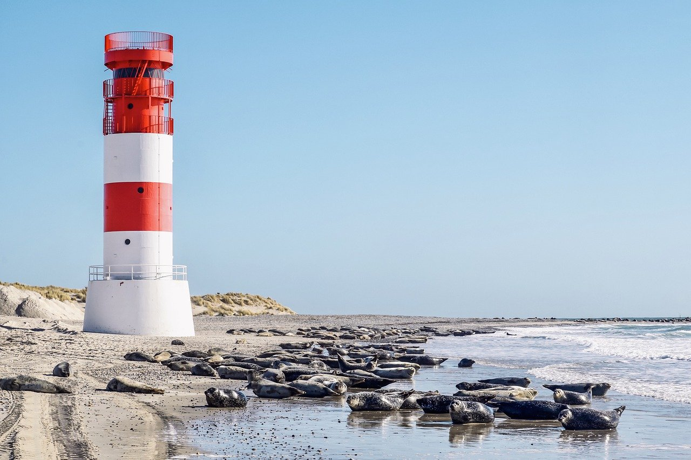
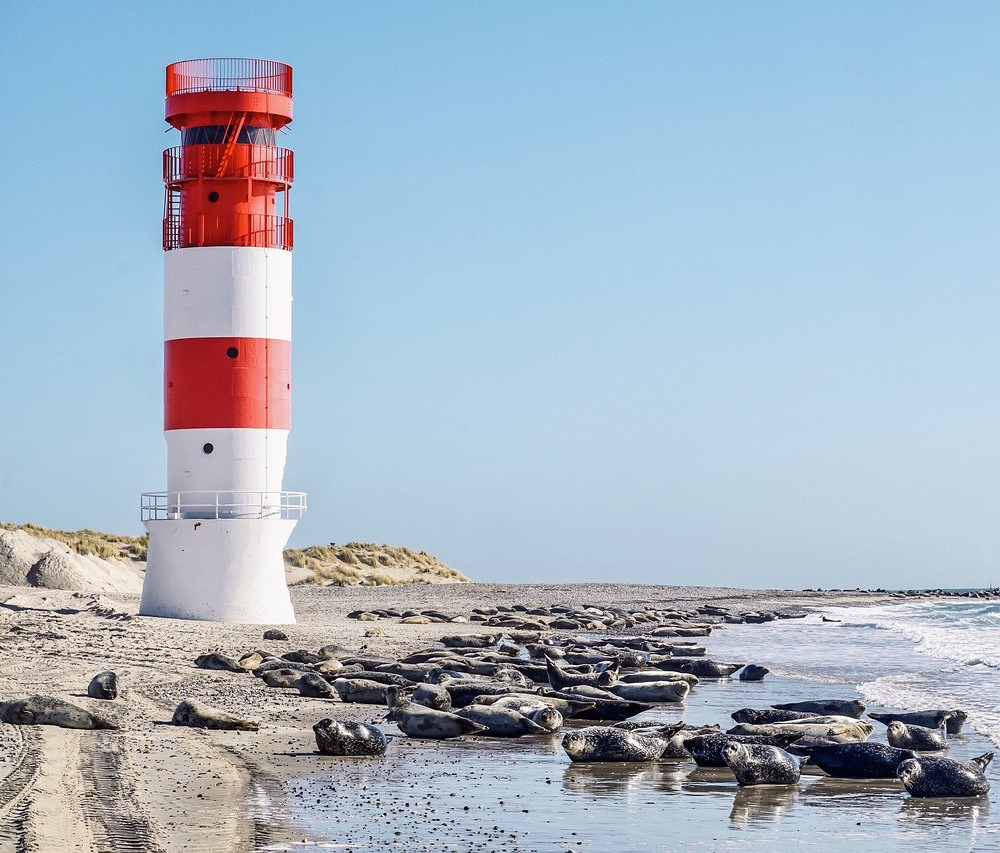
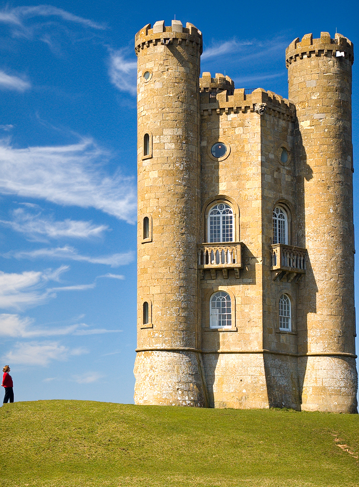

## Yksikkötestit

Käytössä on PIT-mutaatiotestaus. Jokaiselle luokalle pyrin tekemään mahdollisimman kattavat luokkakohtaiset testit.

## Laadun testaaminen

Tällä hetkellä algoritmilla voi skaalata kuvia leveyssuunnassa pienemmäksi. Alla on ensimmäisiä tuloksia helpoilla kuvilla. Kumpikin kuva skaalattiin alkuperäisestä 1000 px leveyteen.

